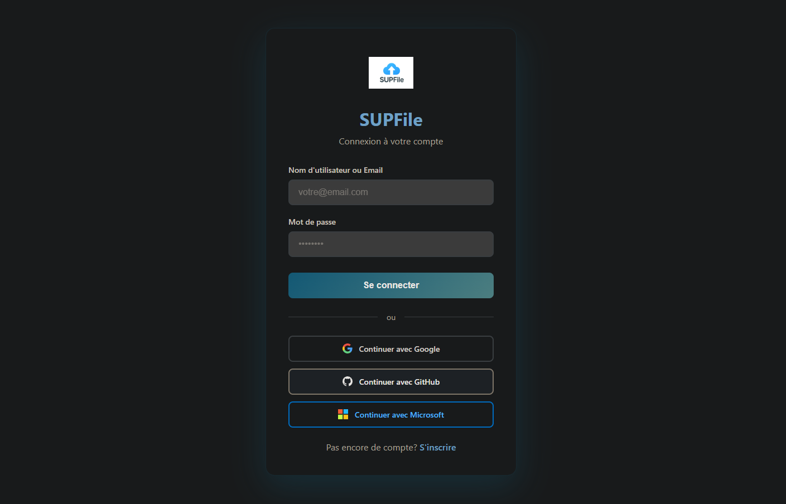
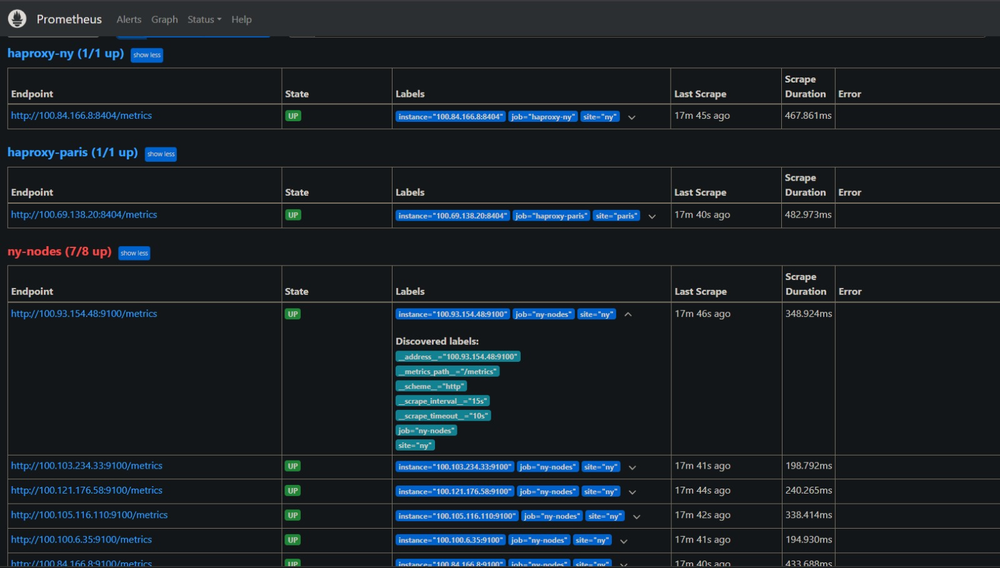
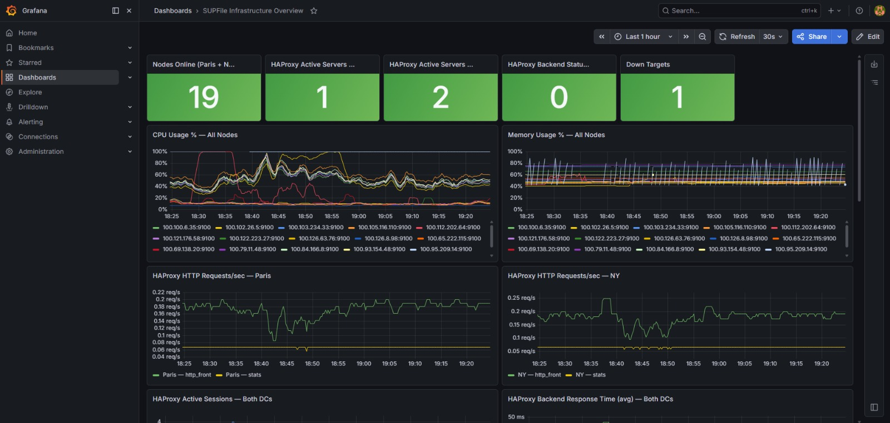
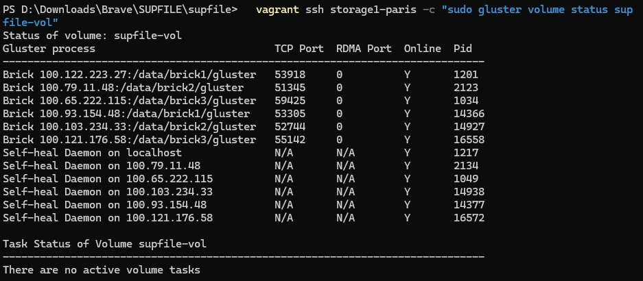
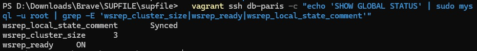
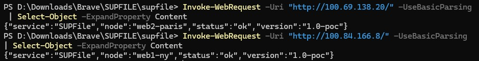
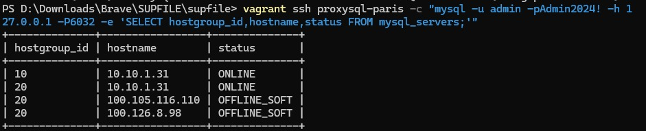

# ☁️ Supfile — Application Web Cloud Multi-Datacenter

<div align="center">
  
  <br>
  <em>Interface web de l'application Supfile déployée et accessible depuis le datacenter de New York.</em>
</div>

---

## 🎯 Mission

Concevoir et déployer une **application web de stockage cloud sécurisée** inspirée de Dropbox, sur une infrastructure **multi-datacenter** résiliente : Paris 🇫🇷 · New York 🇺🇸 · Toronto 🇨🇦.

L'objectif : haute disponibilité, réplication temps réel, monitoring, sauvegarde et sécurité périmétrique sur **17 VMs** réparties sur 3 sites.

---

## 🏆 Résultats marquants

| Indicateur | Valeur |
|---|---|
| Datacenters | 3 (Paris / New York / Toronto) |
| VMs déployées | 17 |
| Bases de données | Galera 3 nœuds (Paris + NY + Toronto) |
| Stockage distribué | GlusterFS 6 briques (3 Paris + 3 NY) |
| Load Balancing | HAProxy + Keepalived (VIP flottante) |
| Monitoring | Prometheus + Grafana (19 panels) |
| Sécurité périmétrique | Fail2ban + Suricata IDS |
| Tests automatisés | 37 preuves (failover, réplication, stockage…) |

---

## 🏗️ Architecture globale

```
Paris (Hyper-V)
├─ lb-paris        HAProxy + Keepalived VIP
├─ web1-paris      Nginx + FastAPI SUPFile
├─ web2-paris      Nginx + FastAPI SUPFile
├─ storage1/2/3    GlusterFS bricks + iSCSI + RAID-1
├─ db-paris        MariaDB Galera (primary bootstrap)
├─ proxysql-paris  ProxySQL read/write split

New York (distant)
├─ lb-ny           HAProxy + Keepalived
├─ web1/2-ny       Nginx + FastAPI SUPFile
├─ storage1/2/3    GlusterFS bricks + iSCSI + RAID-1
├─ db-ny           MariaDB Galera
└─ proxysql-ny     ProxySQL read/write split

Toronto (Debian 100.126.8.98)
├─ monitor         Prometheus + Grafana + DNS round-robin
├─ db-toronto      MariaDB Galera
├─ backup          Backup quotidien vers archives TAR
└─ coldweb         Site de repli froid (DRP)
```

---

## 📁 Structure du dépôt

| Dossier | Contenu |
|---|---|
| [`./0-Architecture Infra Supfile`](./0-Architecture%20Infra%20Supfile/) | Rapports d'infrastructure et conception globale |
| [`./1-Architecture webapp`](./1-Architecture%20webapp/) | Rapports techniques Frontend et Backend SUPFile |
| [`./2-diagrammes`](./2-diagrammes/) | Schémas d'architecture réseau et infrastructure |
| [`./3-captures-ecran`](./3-captures-ecran/) | Preuves visuelles : cluster, monitoring, failover, app déployée |
| [`./4-scripts`](./4-scripts/) | Scripts de provisioning Vagrant, rôles, déploiement et correctifs |
| [`./5-preuves-tests`](./5-preuves-tests/) | 37 fichiers de preuves systèmes et fonctionnelles |
| [`./6- Présentation Projet Supfile`](./6-%20Pr%C3%A9sentation%20Projet%20Supfile/) | Présentation officielle du projet |

---

## 📸 Captures d'écran — Preuves visuelles

### Monitoring & Observabilité

<div align="center">

| Preuve | Capture |
|---|---|
| **Prometheus** — 17 VMs UP |  |
| **Grafana** — 19 panels temps réel |  |

</div>

### Stockage distribué & Réplication

<div align="center">

| Preuve | Capture |
|---|---|
| **GlusterFS** — 6 briques distributed-replicated |  |
| **Galera Cluster** — 3 nœuds wsrep OK |  |

</div>

### Haute disponibilité & Multi-DC

<div align="center">

| Preuve | Capture |
|---|---|
| **Active/Active** — Paris + NY simultanés |  |
| **ProxySQL** — Read/Write split |  |
| **Application déployée** — New York |  |

</div>

---

## 🧪 Tests & Preuves (extrait)

| Catégorie | Preuve |
|---|---|
| **Connectivité** | [Tailscale overlay — toutes VMs connectées](./5-preuves-tests/01-tailscale-overlay-toutes-VMs-connectees.txt) |
| **Health check** | [Paris health OK](./5-preuves-tests/02-paris-health-check-OK.txt) · [NY health OK](./5-preuves-tests/07-ny-health-check-OK.txt) |
| **Failover intra-DC** | [web1 down, web2 prend le relais](./5-preuves-tests/12-failover-intra-DC-web1-down-web2-prend-relais.txt) |
| **Failover inter-sites** | [NY indisponible, bascule automatique](./5-preuves-tests/13-failover-intersite-ny-bascule-automatique.txt) |
| **Réplication** | [Galera sync Paris-NY-Toronto](./5-preuves-tests/15-galera-replication-synchrone-paris-ny-toronto.txt) |
| **Stockage** | [GlusterFS 6/6 bricks online](./5-preuves-tests/17-glusterfs-status-6-briques-online.txt) |
| **Monitoring** | [Prometheus 19 targets UP (web2 NY offline)](./5-preuves-tests/34-prometheus-targets-19-20-UP-web2ny-offline.txt) |
| **Sécurité** | [Fail2ban — 4 jails actives Paris](./5-preuves-tests/26-fail2ban-paris-4-jails-actives.txt) · [Suricata IDS actif](./5-preuves-tests/28-suricata-paris-IDS-actif-alertes.txt) |

> **Tous les tests sont documentés** dans [`./5-preuves-tests`](./5-preuves-tests/) (37 fichiers).

---

## 🚀 Scripts clés (Vagrant + Ansible-like)

| Script | Rôle |
|---|---|
| [`Vagrantfile`](./4-scripts/Vagrantfile) | Provision des 17 VMs multi-sites |
| [`base.sh`](./4-scripts/base.sh) | Base commune à toutes les VMs |
| [`role-lb.sh`](./4-scripts/role-lb.sh) | HAProxy + Keepalived VIP + WireGuard gateway |
| [`role-web1.sh`](./4-scripts/role-web1.sh) / [`role-web2.sh`](./4-scripts/role-web2.sh) | Nginx + FastAPI SUPFile |
| [`role-db.sh`](./4-scripts/role-db.sh) | MariaDB Galera node |
| [`role-proxysql.sh`](./4-scripts/role-proxysql.sh) | ProxySQL read/write split |
| [`role-storage1/2/3.sh`](./4-scripts/role-storage1.sh) | GlusterFS brick + iSCSI target + RAID-1 |
| [`role-monitor.sh`](./4-scripts/role-monitor.sh) | Prometheus + Grafana + dnsmasq GSLB |
| [`setup-grafana-dashboard-v2.sh`](./4-scripts/setup-grafana-dashboard-v2.sh) | Dashboard 19 panels |
| [`setup-haproxy-toronto.sh`](./4-scripts/setup-haproxy-toronto.sh) | GSLB HAProxy Toronto (DNS failover) |
| [`deploy-app-to-ny.sh`](./4-scripts/deploy-app-to-ny.sh) | Déploiement application sur NY |
| [`fix-ny-haproxy-prometheus.sh`](./4-scripts/fix-ny-haproxy-prometheus.sh) | Correctif HAProxy + Prometheus NY |

> **Note POC** : Suricata est arrêté sur `web1-paris` pour libérer de la RAM sur le matériel limité du poste de développement.

---

## 🎤 Présentation officielle

<div align="center">
  <a href="./6-%20Pr%C3%A9sentation%20Projet%20Supfile/SUPFile-Infrastructure-POC.pdf">
    
  </a>
  <br>
  👉 <strong>[Voir la présentation officielle](./6-%20Pr%C3%A9sentation%20Projet%20Supfile/SUPFile-Infrastructure-POC.pdf)</strong>
</div>

---

## 🔗 Liens rapides

- 📁 [Architecture Infra](./0-Architecture%20Infra%20Supfile/)
- 📁 [Architecture Webapp](./1-Architecture%20webapp/)
- 📁 [Diagrammes](./2-diagrammes/)
- 📁 [Captures d'écran](./3-captures-ecran/)
- 📁 [Scripts](./4-scripts/)
- 📁 [Preuves & Tests](./5-preuves-tests/)
- 📁 [Présentation](./6-%20Pr%C3%A9sentation%20Projet%20Supfile/)

---

*Projet fil rouge SUPINFO Paris — Architecture multi-datacenter, résilience et cloud.*